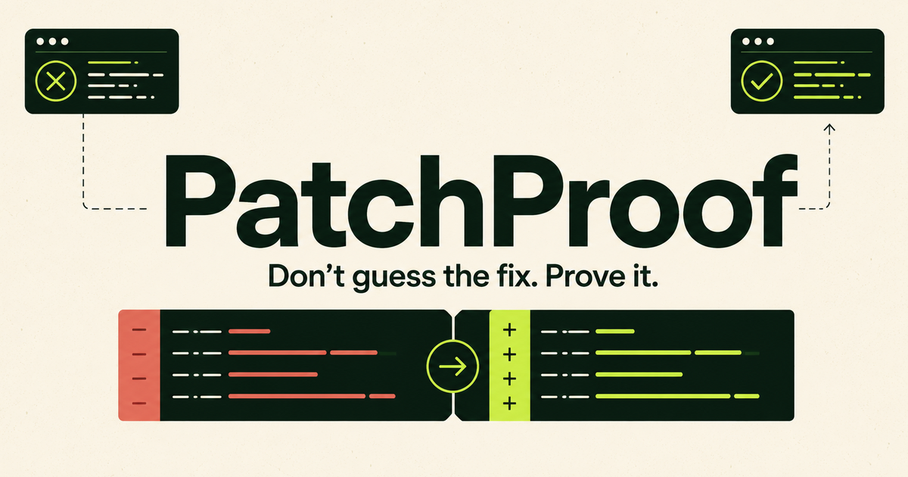
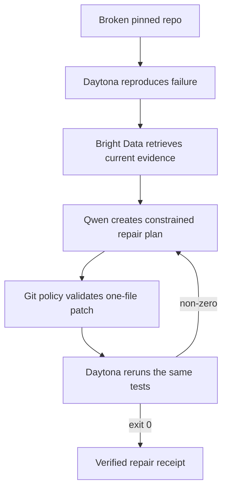

# PatchProof

**Most coding assistants suggest a fix. PatchProof researches the current migration, changes the code in an isolated machine, and proves the same failing test command now passes.**

Express 5 changed route-string syntax. A repository that worked on Express 4 can now crash during startup with `path-to-regexp` errors before a single request is served. PatchProof is deliberately narrow: it repairs that migration reliably instead of pretending to fix every repository.

[Open the live demo](https://patchproof.marallfarhat.chatgpt.site) · [Inspect the pinned broken fixture](https://github.com/MARALFARHAT/patch-proof/tree/express5-broken-demo)



## Three-minute demo

1. Submit the prefilled public repository and pinned broken commit.
2. Daytona creates an ephemeral sandbox, clones the exact commit, installs dependencies, and runs `npm test`.
3. The **BEFORE** panel shows the real non-zero exit code and Express 5 error.
4. Bright Data searches from that error text and retrieves the current Express migration guide plus `path-to-regexp` release evidence.
5. Qwen returns a citation-bound JSON repair plan and minimal unified diff.
6. PatchProof validates the patch with its own parser **and Git's `--numstat`**, applies it through an explicit one-file include filter, and reruns the identical command.
7. The **AFTER** panel turns green only when `npm test` really exits `0`.

## Why the sponsor stack is structural

- **Bright Data — current evidence.** Hosted MCP `search_engine` and `scrape_as_markdown` retrieve migration sources at job time. The query is derived from the reproduced error, and the UI shows each retrieval timestamp.
- **Qwen Cloud — constrained reasoning.** Qwen receives the baseline error, `package.json`, `src/app.js`, retrieved evidence, and any previous failed attempt. It must return exactly `{ rootCause, evidenceIds, patch, unresolvedRisks }`.
- **Daytona — safe action and proof.** Every job runs in an isolated five-minute sandbox. Daytona performs the clone, install, patch, test, rollback, retry, and cleanup; generated code never executes on the application host.
- **Nosana — intentionally omitted.** This single-repository repair has no meaningful GPU workload because Qwen supplies inference and Daytona supplies execution. Nosana becomes justified for batch-repairing hundreds of repositories with a self-hosted repair or reranking model—not as a decorative API call.



## Reliability and safety controls

- Exact public-repository allowlist and pinned 40-character commit
- Full clone so the pinned commit need not remain the default-branch tip
- Fixed install command: `npm ci --ignore-scripts --no-audit --no-fund`
- Fixed verification command: `npm test`
- Generated changes limited to `src/app.js`, 10 KB, and 40 changed lines
- Static diff-header validation plus `git apply --numstat`
- `git apply --include='src/app.js' --exclude='*'` defense in depth
- One active repair at a time and a per-IP cooldown
- Two repair attempts maximum, rollback between attempts
- Ephemeral Daytona sandbox, five-minute TTL, restricted outbound domains, guaranteed cleanup
- No success claim unless final verification exits `0`
- Missing credentials fail closed with `503 CONFIGURATION_REQUIRED`; there is no fake replay mode

## Supported fixture

The deterministic fixture is stored at the root of the `express5-broken-demo` branch and pinned by commit SHA. It contains three real Express 4 → 5 route breaks:

- Optional parameter punctuation: `/:file.:ext?`
- Regexp-like string route: `/[discussion|page]/:slug`
- Unnamed wildcard: `/*`

The default branch keeps a copy under `demo/express5-broken/` for reviewers, but the live agent clones the pinned root-level fixture commit.

## Run locally

```bash
npm ci
npm test
npm run lint
npm run dev
```

Configure runtime values outside Git:

```text
DAYTONA_API_KEY
BRIGHTDATA_API_TOKEN
DASHSCOPE_API_KEY
QWEN_BASE_URL
PATCHPROOF_REPO_ALLOWLIST
PATCHPROOF_DEMO_COMMIT
```

Optional:

```text
QWEN_MODEL=qwen-plus
PATCHPROOF_PUBLIC_ORIGIN=https://patchproof.example.com
```

The repair API streams newline-delimited JSON. Every visible activity item corresponds to a real backend event.

## License

MIT — see [LICENSE](./LICENSE).
